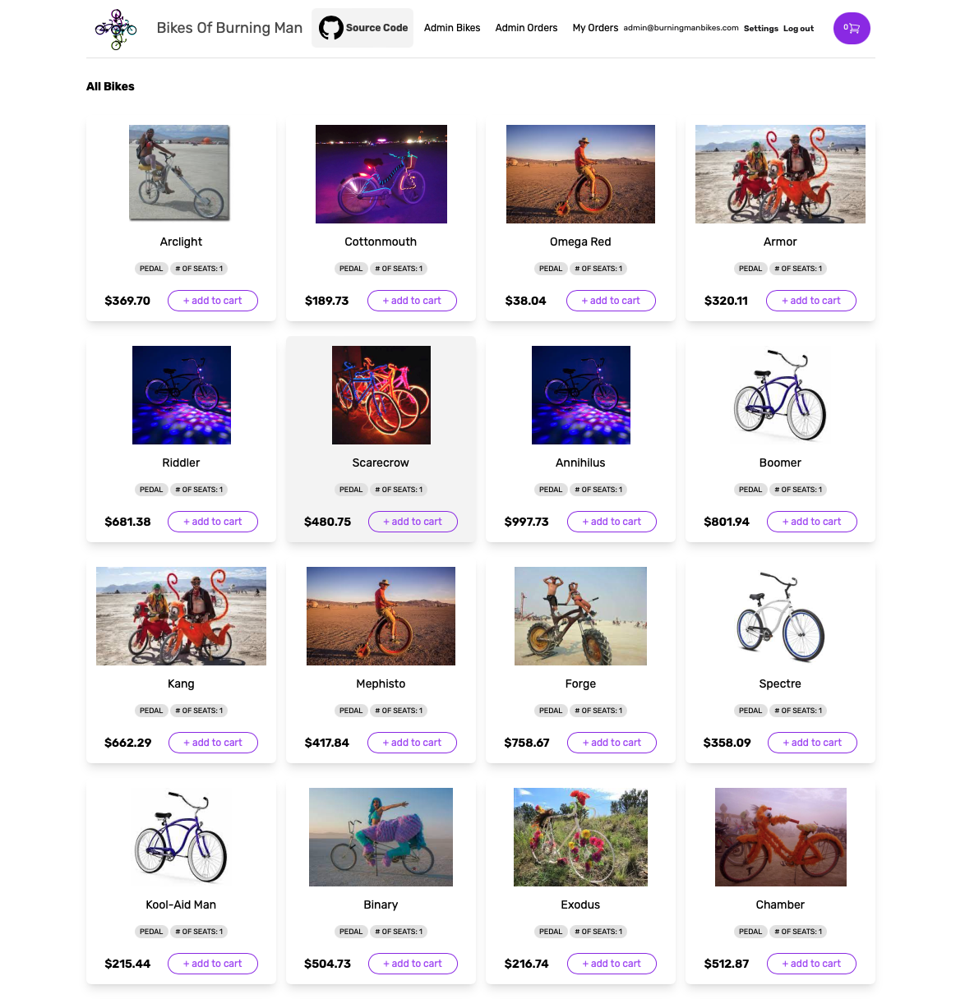
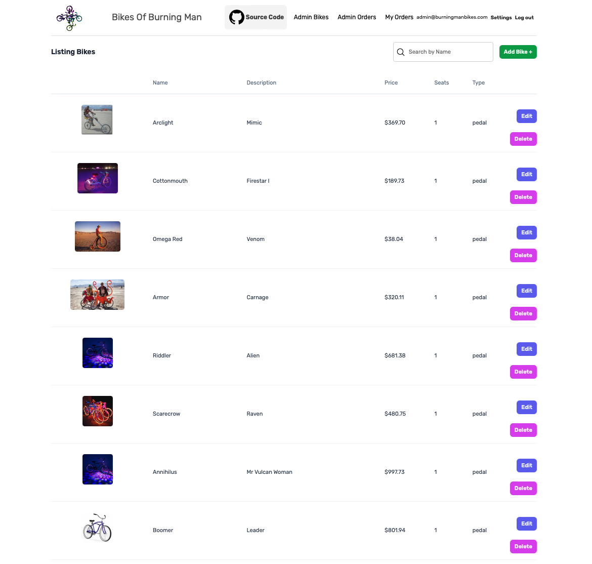
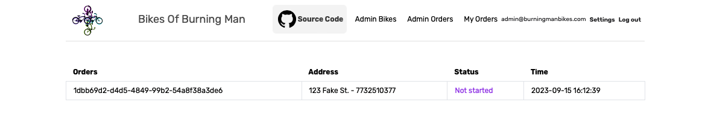
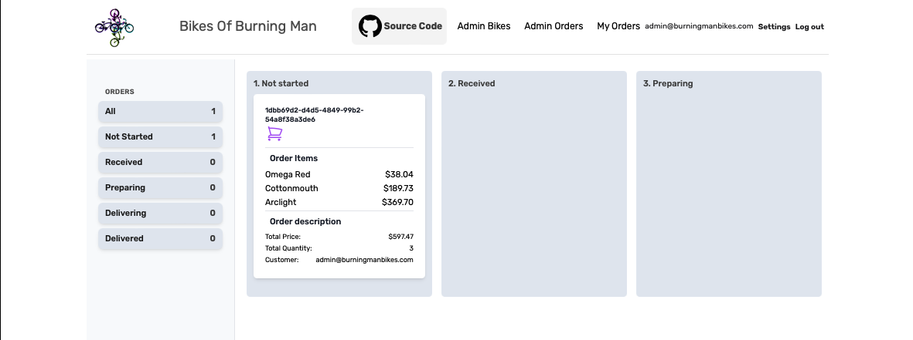
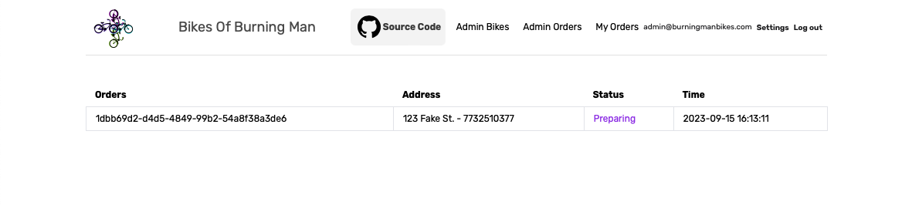
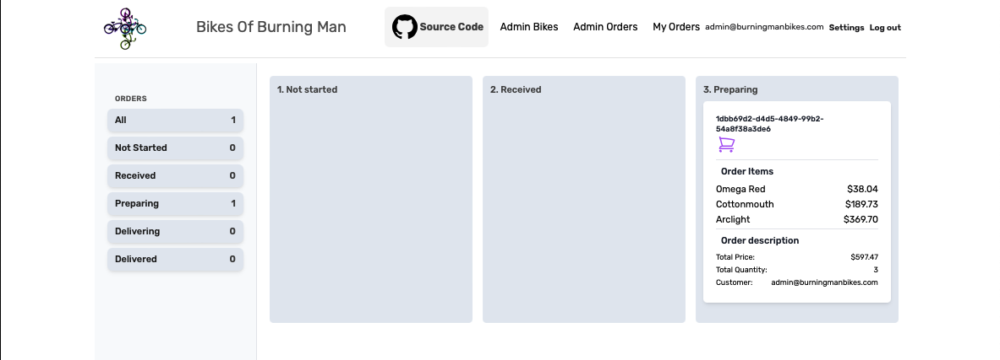

# BikesOfBurningMan BikeShop 
__Demo BikeShop Built with Phoenix LiveView__

## Notable Dependencies
>1. [credo](https://github.com/rrrene/credo) - static code analysis tool for Elixir
>2. [dialyxir](https://github.com/jeremyjh/dialyxir) - elixir dialyxir
>3. [excoveralls](https://github.com/parroty/excoveralls) - code coverage tool
>4. [mix_test_watch](https://github.com/lpil/mix-test.watch) - continuous test runner
>5. [libcluster](https://github.com/bitwalker/libcluster) - provides a mechanism for automatically forming clusters of Erlang nodes

## The UI

### Customer Bikes

### Admin Bikes

### Customer Orders - Not Started

### Admin Orders - Not Started

### Customer Orders - Preparing

### Admin Orders - Preparing
